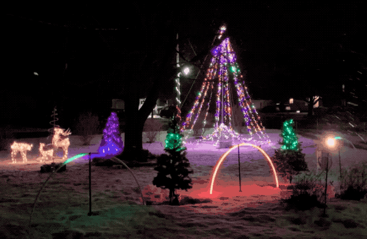

# PiLit Holiday Lighting System

The free, open source, DIY holiday light show animation system.

*My 2019 Christmas lights, powered by PiLit*

There are lots of commercial lighting systems and software. Most are more expensive than I care to pay. So, I built my own.

<blockquote style="background-color: #ff000033; padding-top: 5pt; padding-bottom: 5pt;">
Warning: Building a PiLit system involves wiring and working with wall/mains voltage. You do so at your own risk. If you're not qualified to work with electricity, hire someone who is. Please be safe!
</blockquote>

## Overview

PiLit at a high level is:

* A show control application runs on a Raspberry Pi
* Which sends MQTT messages across the network
* To "nodes" which are the lighting controllers in the yard.
* The nodes are either ESP8266/ESP32 microcontrollers or other Raspberry Pis.
* The nodes control RGB pixels (aka neopixels) or relays to turn on/off light strings, spotlights, etc.

PiLit components:

* pilit_player -- plays the show script
* various nodes:
    * pixel_node: Arduino/ESP8266 C++ controller for RGB "neopixels"
    * onoff_node: Arduino/ESP8266 C++ controller for controlling a single relay (e.g. to turn on/off a spotlight)
    * multi_relay: A Python script meant to run on a Raspberry Pi and controller a multi-channel relay (e.g. a Sainsmart 16-relay board)
* PiLit GUI - A show generation web app to make creating show sequences relatively easy

*My multi-relay node*

*PiLit GUI*

## Requirements

If you want to use this project for yourself, you will need some or all of the following:

* A Raspberry Pi (with WiFi) or other computer capable of running a Python 3.6+ script to use as your central controller.
* ESP8266 or other WiFi-enabled Arduino-compatible microcontrollers for controlling RGB pixels or relays.
* A Raspberry Pi (with WiFi) and a multi-channel relay board to control various standard holiday lights.
* A bunch of outlets, electrical boxes, wire, connectors, etc.
* A pack of female-to-female jumpers (you'll find a bunch of [multipacks like this on Amazon](https://www.amazon.com/gp/product/B00JUKL4XI/ref=oh_aui_detailpage_o09_s00?ie=UTF8&psc=1))
* As many [1000 ohm resistors](https://www.amazon.com/gp/product/B0185FJ6L0/ref=oh_aui_detailpage_o09_s00?ie=UTF8&psc=1) as you have relays
* Something waterproof to house the final product since it will sit outside for the holiday season. I used a large storage tub.

## Usage

You will need programming, electronics, and electrical skills to implement PiLit. This is a DIY system, not a pre-built, out-of-the-box solution. Timing is *not* precisely controlled, so you'll be unlikely to create a whole-yard, synchronized Neopixel extravaganza.

### Show creation

See the pilitgui folder for information on the show creation tool. While in theory, it should run on any platform, I've tested it only on my Mac.

### Running a show

See the pilit_player folder for information on the show runner. You will need a current Python installation and command-line skills to run the player.

### Nodes

See the nodes folder, and its children, for information on building, using, and customizing the nodes. You will need at least basic Arduino skills to load the sketches. You will need electronics and electrical skills to build the nodes.

# License

MIT License

Copyright (c) 2016-2019 Tim Poulsen